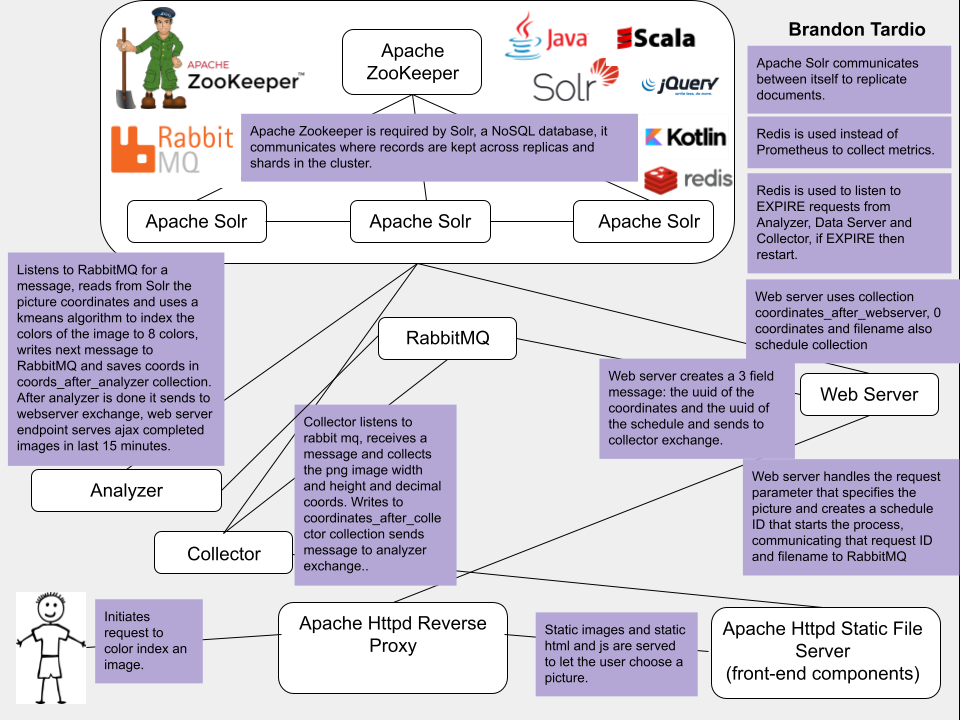

###

### Project: Netoxena.com

### Author: Brandon Tardio

### Github: https://github.com/btardio/basic-ktor-project

###

This project demonstrates an implementation of the KMeans algorithm using
microservices. The solution is horizontally scalable. The biggest lesson learned
at the completion of this assignment is that this architectural style
is susceptible to / can lead to scope creep and failure.
###
This project was very ambitious and I only found success using the MVP 
methodology taught by the professor. I am satisfied with the results. There
is a lot of interest in discovery of how this could be done better but
without a set computing goal the five weeks that I had to complete this 
has taught me a lot about large systems. Some of the key takeaways include
don't take rabbit to the prom, keep mr. potato head out of rags and work 
at load.
###
Don't take Rabbit to the Prom is my summary of the logging troubles that 
Prometheus caused. Once I added Prometheus it did not like scraping from
5 difference medium size AWS machines and brought everything to a halt. 
My solution was to use Redis and I started implementing that solution but
did not have the time to finish.
###
Keep Mr. Potato head out of rags is my analogy of the work that can be thrown
away if you don't check first that a schedule can write or that a task can 
complete. I think this is one of the most important rules because companies
can throw money at problems but the system still has a tremendous amount
of waste that is hidden. This is also a lesson to keep things small.
###
Work at load is another important lesson. I noticed in the system that 
it would require 16s for some tasks to complete that were the first few
tasks but then after a few tasks it would respond pretty consistently at 3
seconds. This was an important observation because I would make assumptions
that something didn't work too early.
###
I saw very early that the docker compose file was limiting. The network 
trickery required to get the machines communicating makes me look forward
to taking a network class. I chose not to go even larger for this project
but in the future I would like to see Docker Swarm or Rancher. I chose Docker
compose because it is probably easier than working with swarm or rancher,
requires less set up, can be mimicked locally for local development, and
is a commonly used technology. In the future I would like to do something that is auto scalable, with
live configuration file updates or env var changes, this is not something 
docker compose offers but docker swarm does.
###
Areas of improvement include but are not limited to, stronger unit testing,
a better serialization format for points, integration testing with larger
images, separating the docker compose services onto separate machines, 
a more robust frontend skin for logging, better connection handling and 
quite a few other items that I currently can't remember. 
###
In conclusion, I found that the project taught me a lot about CAP.
I see where consistency finding the next record is a problem. I also
see the importance of availability and partition tolerance. I look forward
to being considered to join the Master program at Colorado Boulder and
taking some more courses.


# Project K-Means

## Set up

### Local Development (Product Environment)

The local.env file should be sufficient to start up the necessary services in
the docker-compose.yml file. Start up these services using the command:

### Quick Start
Note: For Quick Start it's likely that one will exit before the schema is made, simply re-run the jar command.
``` 
docker compose --env-file=./local.env up --detach
```
Terminal 1
```
docker container exec -it kotlin-ktor-server /bin/bash
gradle -p /webserver/ build  && java -jar /webserver/webserver/build/libs/webserver.jar
```
Terminal 2
```
docker container exec -it kotlin-ktor-analyzer /bin/bash
gradle -p /analyzer/ build  && java -jar /analyzer/analyzer/build/libs/analyzer.jar
```
Terminal 3
```
docker container exec -it kotlin-ktor-collector /bin/bash
gradle -p /collector/ build  && java -jar /collector/collector/build/libs/collector.jar
```


#

Each of the three: collector, analyzer and webserver is started in an infinite
loop to keep them from restarting.

```
while true; do echo 'ACK'; sleep 1; done"
```

These do no currently start the application. Local developers can exec
into the services and mount the volume to integrate with the IDE. The clean
and build step can be skipped.

Collector:
```
docker container exec -it kotlin-ktor-collector /bin/bash
./gradlew clean && 
./gradlew build && 
java -jar -agentlib:jdwp=transport=dt_socket,server=y,suspend=n,address=*:5005 /collector/collector/build/libs/collector.jar

```

Webserver:
```
docker container exec -it kotlin-ktor-server /bin/bash
./gradlew clean && 
./gradlew build && 
java -jar -agentlib:jdwp=transport=dt_socket,server=y,suspend=n,address=*:5005 /webserver/webserver/build/libs/webserver.jar
```

Analyzer:
```
docker container exec -it kotlin-ktor-analyzer /bin/bash
./gradlew clean && 
./gradlew build && 
java -jar -agentlib:jdwp=transport=dt_socket,server=y,suspend=n,address=*:5005 /analyzer/analyzer/build/libs/analyzer.jar
```

#### Build System

Project is using gradle, original build-logic directory was beyond my experience and so used a simpler
gradle-init command to combine scala, java, kotlin.

### Running the Application (Product Environment & Rest Collaboration internal or API endpoint)

The application comes with a very minimal JQuery frontend located in the httpd/htdocs/index.html directory.

#

http://netoxena.com

#

Exposed endpoints are:

http://netty.netoxena.com/startKmeans/{filename}.png

This endpoint starts a kmeans job for one of the predefined pictures.

#

http://netty.netoxena.com/getAllSchedules

This endpoint sends a request to the back end to return all jobs in the last 15 minutes.

### Data persistence

#### Solr
The application uses Solr, a document database to store the pixel values of the images.
This is a horizontally scaling database and uses Zookeeper for coordination of replicas
shards and collections.

Observations working with Solr were that it doesn't work anymore once a replica or shard isn't
available, and it doesn't recover. It was my observation that it likes many replicas and many
shards and the larger the better. This is a repeated observation working with
Rabbit, Solr and Zookeeper.

There are three collections, one collection for each the collector, the analyzer and the webserver.

Further improvements are the clean up the records once they are completed in the system and
save the a vertically scaling database.

#### Redis
Redis is also used in the project, chosen because it has an EXPIRE instruction and is fairly
straightforward and simple to work with. This is used to keep the individual rabbit queues
going, it was observed that they sometimes fail and their queues get backed up. The collector
analyzer and webserver send a SET request to redis that expires in 60 seconds, if the collector
analyzer and webserver aren't succeeding consuming records on their queue they are restarted.

This strategy seems to work very well and further improvements could be made to have more than 1
analyzer collector webserver ready for failures.

It is my guess that Solr is implemented keeping it highly available by periodically dumping long
lasting or stale connections.

### Unit tests

There is one large unit test using test containers for each of the collector, analyzer and webserver.

The test has greater than 80% code coverage for the consumer.

This is an area that could be further worked on and need improvement.

### Analyzer, Collector, Server

The analyzer collector and server share a similar architecture. Read from the previous
exchange the schedule, read from solr the RGB coordinates, perform some processing on the
RGB coordinates and write to the next Solr collection.

Rabbit messages pass through the system starting at the data server, progressing to the collector
and then the analyzer and finally back to the data server.

Consistency is handled in all three by simply publishing back to the same queue that was consumed
the message that didn't yet have the coordinates available on the Solr database.

The data format chosen was json and for simplicity to complete the project on time the same
serializable records is used for solr. This format has two uuids and jsonData. This was also picked
because the indexed value is a uuid.

#### Data Analyzer

The data analyzer is written in Kotlin, Java and Scala. I reused an assignment from a course
online moderated by EFPL University Switzerland. The image indexing algorithm uses k-means.

#### Data Collector

The data collector collects an image and converts the image into pixel RGB XYZ values between 0 and 1.

#### Data Server

The data server coordinates start of a schedule and end of a schedule, also providing REST endpoints.
It could be an improvement to further separate the Netty from the Rabbit consumer.

### Integration Tests

A simple integration test written in Python tests the system and makes sure that all records
return successfully and record the time that it takes them to return. This integration
test is found in the root directory: keepalive.py

Improvements to this include building it bigger to see how the system handles at load.

### Continuous Integration

The continuous integration uses github actions. The definition is:

One of the goals of this project was to make a docker-compose.yml that local development and production versions
were very similar. This goal was accomplished using docker compose and environment files. Local development was an above
average experience.

```

  continuous-integration:
    runs-on: ubuntu-latest
    steps:
      # Step 1
      - uses: actions/checkout@v2
      # Step 2
      - name: Set up JDK 17
        uses: actions/setup-java@v2
        with:
          java-version: '17'
          distribution: 'adopt'
      # Step 3
      - name: Build Application and Run unit Test
        run: gradle build

```

### Production monitoring instrumenting

I saw a significant degredation in the system after implementing prometheus and
it led me to remove the logger and prometheus in exchange for a redis expiring
log entries. This can be seen at url http://netty.netoxena.com/metrics and
http://netty.netoxena.com/metricsDump. This is a general observation that whenever
the system comes under a lot of load these monitoring instruments aren't reachable.


### Continuous Deploy

The application uses AWS CI/CD Code Deploy. The github action that triggers this is

```

  continuous-deployment:
    runs-on: ubuntu-latest
    if: github.ref == 'refs/heads/master'
    steps:
     # Step 1
      - name: Configure AWS credentials
        uses: aws-actions/configure-aws-credentials@v1
        with:
          aws-access-key-id: ${{ secrets.AWS_ACCESS_KEY_ID }}
          aws-secret-access-key: ${{ secrets.AWS_SECRET_ACCESS_KEY }}
          aws-region: ${{ secrets.AWS_REGION }}
      # Step 2
      - name: Create CodeDeploy Deployment
        id: deploy
        run: |
          aws deploy create-deployment \
            --application-name MyDeploymentGroupName \
            --deployment-group-name MyDeploymentGroupName \
            --deployment-config-name CodeDeployDefault.AllAtOnce \
            --github-location repository=${{ github.repository }},commitId=${{ github.sha }}

```

The cloud formation code deploy group is:

```

    codeDeply:
        DependsOn: [A, B, C, D, E]
        Type: AWS::CodeDeploy::DeploymentGroup
        Properties:
            ApplicationName: !Ref cdApp
            DeploymentGroupName: !Ref DeploymentGroupName
            DeploymentConfigName: CodeDeployDefault.AllAtOnce
            AutoRollbackConfiguration:
                Enabled: true
                Events:
                  - DEPLOYMENT_FAILURE
                  - DEPLOYMENT_STOP_ON_REQUEST
            ServiceRoleArn: !GetAtt cdRole.Arn  #GetAtt returns a
            Ec2TagSet:
                Ec2TagSetList:
                  - Ec2TagGroup:
                      - Type: KEY_AND_VALUE
                        Key: "deploymentgroup"
                        Value: "kotlindeploy"

```

### Diagram




### Misc

Read logs of deploy live.
```
tail -f /opt/codedeploy-agent/deployment-root/deployment-logs/codedeploy-agent-deployments.log
```
